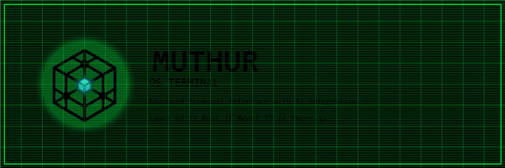

<div align="center">

<br>



<br>

```
 SYSTEM ONLINE ──────────────────────────────────────────────────────────
 PLATFORM: Linux (Arch | Ubuntu | Debian | Fedora)    BINARY: ~18 MB
 BACKEND:  Rust + Tauri v2                            CPU:    <10% idle
 FRONTEND: React 19 + TypeScript + Vite               RAM:    ~150 MB
 AI:       Ollama (llama3.2 default)                  STATUS: ACTIVE
 ────────────────────────────────────────────────────────────────────────
```

<p align="center">
  
  
  
  
  
  
  
</p>

<br>

**Fullscreen cinematic terminal interface for Linux.**<br>
*Inspired by eDEX-UI and MU/TH/UR 6000 from Alien (1979).*

<br>

[`> INSTALL`](#installation) · [`> REQUIREMENTS`](#requirements) · [`> FEATURES`](#features) · [`> USAGE`](#usage) · [`> LIVE`](https://krko2n.github.io/Muthur-os-terminal)

</div>

---

---

## What is MUTHUR?

MUTHUR is a desktop terminal application that wraps a fully functional Linux shell inside a science-fiction cockpit interface. It is not a theme or a skin -- it is a standalone native application built from the ground up with Tauri v2 and Rust.

Think of it as a spiritual successor to [eDEX-UI](https://github.com/GitSquared/edex-ui), rebuilt for 2026 with a modern stack:

| | eDEX-UI | MUTHUR |
|---|---|---|
| Framework | Electron | Tauri v2 (Rust) |
| Binary size | ~200 MB | ~18 MB |
| Idle CPU | 20-40% | <10% |
| RAM | 400+ MB | ~150 MB |
| AI | None | Ollama (local LLM) |
| Terminal tabs | No | Yes |
| Status | Archived | Active |

---

## Features

- **Terminal** -- Full Linux shell with tabs, 256 colors, GPU-accelerated rendering
- **AI Assistant** -- Local Ollama chat with offline archive grounding and explicit web/fetch tools
- **System Monitor** -- Live CPU, storage, hardware, and process tracking
- **3D Globe** -- Rotating Earth with optional remote data visualization
- **File Explorer** -- Browse user/app/offline-pack files with safer default boundaries
- **Text Browser** -- Built-in http/https browser with ASCII image rendering
- **Kiosk Mode** -- Run MUTHUR as your entire desktop (replaces your DE)
- **CRT Aesthetic** -- Scanlines, green phosphor glow, dot-grid background

---

## Requirements

You need a Linux computer. Windows and Mac are not supported.

**Minimum specs:**

| What | You need |
|---|---|
| Operating System | Linux -- Arch, Ubuntu 22.04+, Debian 12+, or Fedora 38+ |
| Processor | Any 64-bit Intel or AMD (x86_64) |
| RAM | 2 GB |
| Disk space | 500 MB free |
| Graphics | Any GPU that supports OpenGL 3.0 (most from 2010+) |
| Screen | 1280x720 or larger |

**For the best experience:**

| What | Recommended |
|---|---|
| Operating System | Arch Linux or Ubuntu 24.04 |
| Screen | 1920x1080 fullscreen |
| Optional | [Ollama](https://ollama.com/) installed for the AI features |

---

## Installation

### Step 1: Open a terminal

On your Linux machine, open any terminal application (Konsole, GNOME Terminal, Alacritty, etc).

### Step 2: Download the project

```bash
git clone https://github.com/krko2n/Muthur-os-terminal.git
```

This downloads the entire project to your computer.

### Step 3: Enter the folder

```bash
cd Muthur-os-terminal
```

### Step 4: Run the installer

```bash
./install.sh
```

That's it. This one command does everything:

1. Detects your Linux distro (Arch, Ubuntu, Debian, or Fedora)
2. Installs system libraries your machine needs
3. Installs Rust and Node.js (if you don't have them)
4. Installs Ollama for AI features (optional, non-fatal if it fails)
5. Builds MUTHUR from source (takes 5-10 minutes)
6. Places the app in `/usr/local/bin/` so you can run it from anywhere
7. Creates a desktop shortcut so it shows up in your app menu
8. Installs extra tools: `mother-ui`, `kys`

The script will ask for your sudo password when it needs to install system-wide files.

Safer install modes:

```bash
./install.sh --dry-run
./install.sh --no-deps
./install.sh --no-ollama
./install.sh --prefix "$HOME/.local"
./install.sh --quiet
```

`--dry-run` prints the detected plan and exits before changes. `--no-deps` skips distro, Rust, and Node dependency installation. `--no-ollama` keeps optional offline-AI setup out of the install/update flow. A custom `--prefix` installs user binaries under that prefix and skips system session files. `--quiet` reduces installer chatter for scripted runs.

### Step 5: Launch

```bash
muthur
```

Or find **MUTHUR OS Terminal** in your application menu.

---

## Upgrading

Already have MUTHUR installed and want the latest version? Run:

```bash
cd Muthur-os-terminal
git pull
./install.sh
```

The same `install.sh` handles upgrades. It will:
- Rebuild with the latest code
- Replace old binaries with new ones
- Keep your personal config, logs, and crash reports untouched

You never lose your settings when upgrading.

---

## After Installation -- What You Can Do

### Run MUTHUR normally

```bash
muthur
```

Launches the terminal in fullscreen. Use it like any terminal -- type commands, install packages, write code.

### Make MUTHUR start automatically on login

```bash
mother-ui enable
```

Next time you log in, MUTHUR launches fullscreen automatically.

To turn this off:

```bash
mother-ui disable
```

### Check what's configured

```bash
mother-ui status
```

Shows whether autostart is active and what login system you're using.

### Shut down your computer

```bash
kys
```

Shows a warning, counts down 10 seconds (press Ctrl+C to cancel), then powers off.

---

## Usage

### Keyboard Shortcuts

| Press this | What happens |
|---|---|
| `Ctrl+Shift+T` | Open a new terminal tab |
| `Ctrl+Shift+W` | Close the current tab |
| `Ctrl+Tab` | Switch to next tab |
| `Ctrl+Shift+Tab` | Switch to previous tab |

### Tabs

The top of the terminal shows your open tabs. You can have multiple shells open at once, plus a built-in web browser.

- Click **+ shell** to open a new terminal
- Click **+ net** to open the built-in browser
- Click a tab to switch to it
- Click **x** on a tab to close it

### Built-in Browser

Click **+ net** to open a browser tab. Type a URL or search term and press Enter. The browser renders http/https pages as styled text with clickable links. Images are converted to ASCII art automatically. Unsafe schemes such as `file://`, `javascript:`, `data:`, and `ftp://` are rejected by the backend.

### File Explorer

The bottom-left panel shows your files. Click folders to navigate. Click files to open them in a text editor (the editor opens in a new terminal tab).

### AI Assistant

The right panel has an AI chat. Type questions or requests:

```
What does the chmod command do?
How do I find large files on my system?
```

Normal AI chat runs through your configured Ollama endpoint, which defaults to your local machine. The panel searches the offline archive first when local wiki/docs are available. Commands such as `web <query>` and `fetch <url>` intentionally use the network.

### 3D Globe

The top-right shows a rotating globe with real-time conflict/event data. Click the mode buttons (CONFLICTS, CYBER, FLIGHTS) to switch views. Click REFRESH to reload data.

---

## Kiosk Mode (Advanced)

Want MUTHUR to BE your desktop? No taskbar, no other apps -- just MUTHUR as the entire user interface.

**Requirements:**
- `cage` compositor: `sudo pacman -S cage` (Arch) or your distro equivalent
- `greetd` login manager (optional but recommended)

**Quick setup:**

```bash
mother-ui enable
```

**Full lockdown** (prevents keyboard escape routes):

```bash
# Read the guide first:
cat ~/.config/muthur/kiosk/README-KIOSK.md

# Then apply hardening:
sudo cp ~/.config/muthur/kiosk/muthur-kiosk.conf /etc/systemd/logind.conf.d/
sudo cp ~/.config/muthur/kiosk/99-muthur-kiosk.conf /etc/sysctl.d/
sudo sysctl --system
sudo systemctl restart systemd-logind
```

**To get out of kiosk mode:**
- Boot into GRUB recovery mode, or
- SSH in from another computer, or
- Boot from a USB drive

Full instructions are in `~/.config/muthur/kiosk/README-KIOSK.md` after installation.

---

## Configuration

### AI Model

Default AI model is `llama3.2`. To change it, create `~/.config/muthur/config.toml`:

```toml
[ai]
model = "llama3.1"
base_url = "http://localhost:11434"
```

Or set an environment variable:

```bash
export MUTHUR_AI_MODEL=mixtral
muthur
```

See [`examples/config.toml.example`](examples/config.toml.example) for all options.

### Security Overrides

MUTHUR blocks unsafe web schemes, private network fetch targets, broad filesystem browsing, and hidden file browsing by default.

```bash
MUTHUR_ALLOW_PRIVATE_FETCH=1 muthur
MUTHUR_ALLOW_FULL_FS=1 muthur
MUTHUR_SHOW_HIDDEN_FILES=1 muthur
```

Use these only when you intentionally want broader local access.

---

## Troubleshooting

### "Session closed" appears immediately

Your shell is not configured. Fix:

```bash
# Check your shell
echo $SHELL

# If empty, install bash:
sudo apt install bash        # Ubuntu/Debian
sudo pacman -S bash          # Arch
sudo dnf install bash        # Fedora
```

### AI panel shows "ERROR"

Ollama needs to be running:

```bash
ollama serve
```

Then verify it responds:

```bash
curl http://localhost:11434
```

### Black screen or graphics glitches

Check your OpenGL version:

```bash
glxinfo | grep "OpenGL version"
```

You need OpenGL 3.0 or higher. If your GPU is old, try software rendering:

```bash
LIBGL_ALWAYS_SOFTWARE=1 muthur
```

### Build fails

Make sure all system libraries are installed:

```bash
# Ubuntu/Debian:
sudo apt install build-essential libgtk-3-dev libwebkit2gtk-4.1-dev librsvg2-dev libssl-dev

# Arch:
sudo pacman -S base-devel gtk3 webkit2gtk-4.1 libappindicator-gtk3 librsvg openssl

# Fedora:
sudo dnf install gcc gcc-c++ make gtk3-devel webkit2gtk4.1-devel librsvg2-devel openssl-devel
```

Then re-run `./install.sh`.

---

## Uninstalling

```bash
# Remove the binary and tools
sudo rm /usr/local/bin/muthur
sudo rm /usr/local/bin/mother-ui
sudo rm /usr/local/bin/kys
sudo rm /usr/bin/muthur-session
sudo rm /usr/bin/muthur-os-terminal

# Remove desktop entries
rm ~/.local/share/applications/muthur.desktop

# Remove your config (optional -- only if you want to erase settings)
rm -rf ~/.config/muthur
rm -rf ~/.config/xKOR_3RR0R
```

---

## Development

If you want to contribute or hack on MUTHUR:

```bash
git clone https://github.com/krko2n/Muthur-os-terminal.git
cd Muthur-os-terminal
npm install
npm run tauri dev
```

This starts a hot-reload development server. Changes to frontend code appear instantly.

### Project Structure

```
src-tauri/src/          Rust backend
  main.rs               Commands and app setup
  pty.rs                Terminal session management
  browser.rs            HTML parser for built-in browser
  ascii_image.rs        Image-to-braille converter
  system.rs             System stats collection
  ai.rs                 Ollama AI client
  crash.rs              Crash reporting

src/components/         React frontend
  Terminal.tsx           Multi-tab terminal with browser
  BrowserView.tsx       Structured web page renderer
  Header.tsx            Top status bar
  Globe.tsx             3D Earth visualization
  FileExplorer.tsx      File browser grid
  AIPanel.tsx           AI chat panel
  LeftPanel.tsx         System monitoring
  BottomPanel.tsx       File explorer + keyboard
  Keyboard.tsx          On-screen keyboard
  CustomCursor.tsx      Animated cursor

packaging/              System integration
  bin/mother-ui         Autostart manager
  bin/kys               Shutdown command
  muthur-session        Kiosk compositor wrapper
  kiosk/                Lockdown configs
  compositors/          Hyprland/Sway profiles
```

---

## Contributing

See [CONTRIBUTING.md](CONTRIBUTING.md) for guidelines.

Rules:
- Conventional commits (`feat:`, `fix:`, `docs:`)
- No emojis anywhere
- Rust: `rustfmt` + `clippy -D warnings`
- TypeScript: Prettier + ESLint

---

## License

MIT -- see [LICENSE](LICENSE).

---

<div align="center">

**INTERFACE 2037 READY**

[Report Bug](https://github.com/krko2n/Muthur-os-terminal/issues) | [Request Feature](https://github.com/krko2n/Muthur-os-terminal/issues) | [Discussions](https://github.com/krko2n/Muthur-os-terminal/discussions)

---

<!-- MUTHUR-STATS:START -->


<!-- MUTHUR-STATS:END -->

</div>
