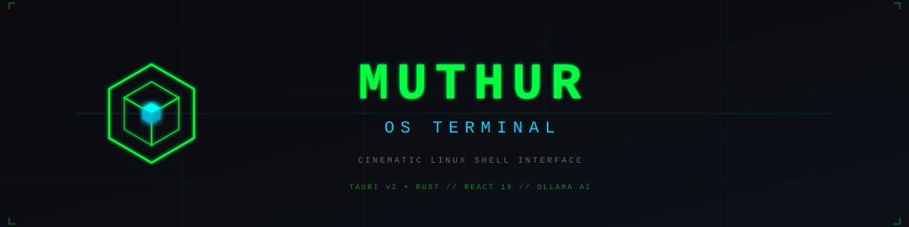
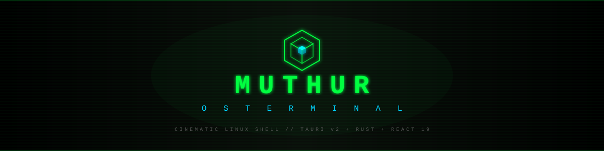
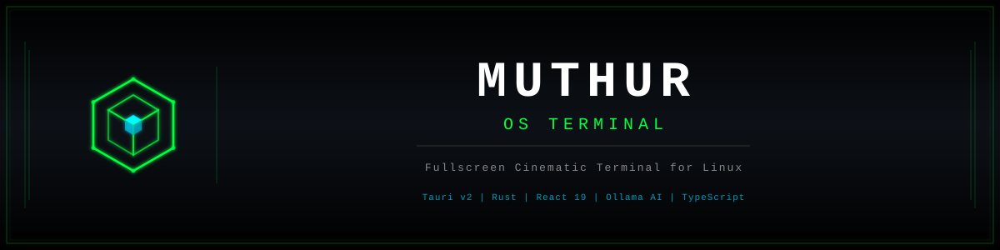
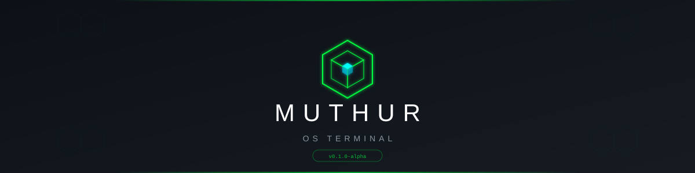
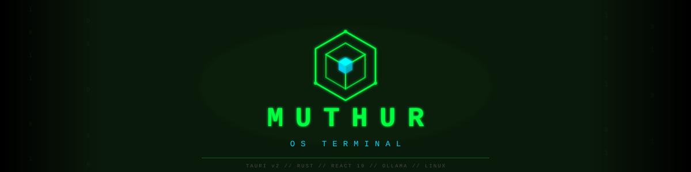
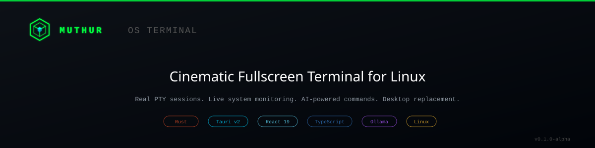
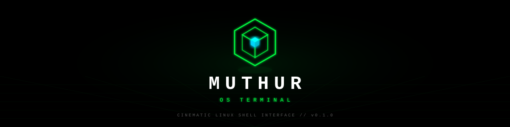
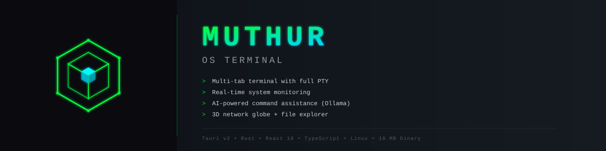
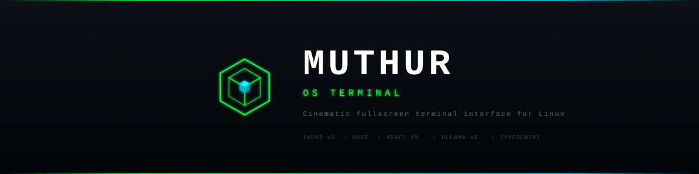
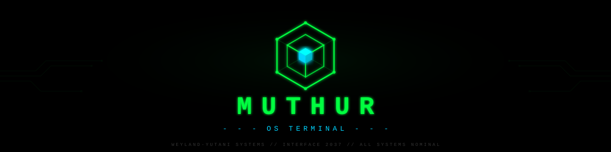

# HEADER OPTIONS - Pick 1 number + 1 letter (e.g. "5E" or "2H")

> **Numbers (1-10)** = header layout style
> **Letters (A-J)** = banner design
>
> Once you pick, I will combine your chosen banner + layout and remove everything else.

---

# BANNERS (A-J) - Pick one letter

## Banner A - Clean left-logo, subtle grid, dark



---

## Banner B - Centered logo above title, CRT scanlines



---

## Banner C - White title, framed with double border, logo left



---

## Banner D - Modern/minimal, centered logo, sans-serif title, hex accents



---

## Banner E - Matrix rain, big centered cube, heavy glow



---

## Banner F - SaaS/startup style, top accent bar, pill badges, clean



---

## Banner G - Perspective grid floor, floating cube, white title



---

## Banner H - Split panel (dark left with logo, content right), gradient title



---

## Banner I - Diagonal lines, gradient border (green to cyan), bold white title



---

## Banner J - Circuit traces, large glowing cube, Alien film reference



---
---

# HEADER LAYOUTS (1-10) - Pick one number

All previews below use Banner A as placeholder. Your letter choice replaces it.

---

## Layout 1 - Clean professional, for-the-badge, dark labels

<div align="center">

<br>


<br><br>

<p align="center">
  <a href="LICENSE"></a>
  
  <a href="https://v2.tauri.app"></a>
  
  
  
</p>

<p align="center">
  
  
  
</p>

<br>

**A fullscreen cinematic terminal OS interface for Linux.**<br>
Real terminals. Live system monitoring. Local AI. Full desktop replacement.

*Spiritual successor to eDEX-UI. Inspired by MU/TH/UR 6000 from Alien (1979).*

<br>

[**GET STARTED**](#installation) | [**FEATURES**](#features) | [**USAGE**](#usage) | [**CONFIG**](#configuration) | [**LIVE PAGE**](https://krko2n.github.io/Muthur-os-terminal)

</div>

---

## Layout 2 - System readout terminal block

<div align="center">

<br>


<br>

```
 SYSTEM ONLINE ──────────────────────────────────────────────────────────
 PLATFORM: Linux (Arch | Ubuntu | Debian | Fedora)    BINARY: ~18 MB
 BACKEND:  Rust + Tauri v2                            CPU:    <10% idle
 FRONTEND: React 19 + TypeScript + Vite               RAM:    ~150 MB
 AI:       Ollama (llama3.2 default)                  STATUS: ACTIVE
 ────────────────────────────────────────────────────────────────────────
```

<p align="center">
  
  
  
  
  
  
  
</p>

<br>

**Fullscreen cinematic terminal interface for Linux.**<br>
*Inspired by eDEX-UI and MU/TH/UR 6000 from Alien (1979).*

<br>

[`> INSTALL`](#installation) · [`> FEATURES`](#features) · [`> USAGE`](#usage) · [`> LIVE`](https://krko2n.github.io/Muthur-os-terminal)

</div>

---

## Layout 3 - Black badges, blockquote tagline

<div align="center">

<br>


<br><br>

<p align="center">
  <a href="LICENSE"></a>
  
  
  
  
</p>

<br>

> A fullscreen cinematic terminal OS for Linux. Real shells. Live monitoring.
> Local AI. 18 MB binary. Sub-10ms latency. Built to replace your desktop.

<br>

[**INSTALL**](#installation) · [**FEATURES**](#features) · [**USAGE**](#usage) · [**CONFIG**](#configuration) · [**LIVE PAGE**](https://krko2n.github.io/Muthur-os-terminal)

</div>

---

## Layout 4 - Compact, flat-square, single row

<div align="center">

<br>


<br><br>

[](LICENSE)
[](#installation)
[](https://v2.tauri.app)
[](#architecture)
[](#architecture)
[](https://github.com/krko2n/Muthur-os-terminal/stargazers)

<br>

**Cinematic fullscreen terminal OS for Linux.**<br>
Real PTY sessions. Live system monitoring. AI-powered commands. Desktop replacement.

<sub>Built with Tauri v2 + Rust | Inspired by eDEX-UI and Alien (1979)</sub>

<br>

[Install](#installation) · [Features](#features) · [Usage](#usage) · [Config](#configuration) · [Live Page](https://krko2n.github.io/Muthur-os-terminal)

</div>

---

## Layout 5 - Terminal UI box with specs

<div align="center">

<br>


<br><br>

```
┌──────────────────────────────────────────────────────────────────────────┐
│  MUTHUR://OS_TERMINAL                                  STATUS: ONLINE    │
│  ════════════════════                                                    │
│  A fullscreen cinematic terminal OS interface for Linux.                  │
│  Real terminals. Live system data. Local AI. Full desktop replacement.    │
│                                                                          │
│  PLATFORM:  Arch | Ubuntu | Debian | Fedora       BINARY SIZE:  ~18 MB   │
│  BACKEND:   Rust + Tauri v2                       IDLE CPU:     <10%     │
│  FRONTEND:  React 19 + TypeScript                 IDLE RAM:     ~150 MB  │
│  AI:        Ollama (local, private)               LATENCY:      <10ms    │
└──────────────────────────────────────────────────────────────────────────┘
```

<p align="center">
  
  
  
  <a href="https://github.com/krko2n/Muthur-os-terminal/stargazers"></a>
</p>

<br>

[`> INSTALL`](#installation) · [`> FEATURES`](#features) · [`> USAGE`](#usage) · [`> CONFIG`](#configuration) · [`> LIVE PAGE`](https://krko2n.github.io/Muthur-os-terminal)

</div>

---

## Layout 6 - Ultra-minimal, banner does the talking

<div align="center">

<br>


<br><br>


<br><br>

Fullscreen cinematic terminal interface for Linux.<br>
Real shells. Live monitoring. Local AI. 18 MB. Sub-10ms latency.

<br>

[Install](#installation) · [Features](#features) · [Usage](#usage) · [Live Page](https://krko2n.github.io/Muthur-os-terminal)

</div>

---

## Layout 7 - Professional with feature table

<div align="center">

<br>


<br><br>

<p align="center">
  <a href="LICENSE"></a>
  
  <a href="https://github.com/krko2n/Muthur-os-terminal/stargazers"></a>
  <a href="https://github.com/krko2n/Muthur-os-terminal/releases"></a>
</p>

<br>

**MUTHUR OS Terminal** is a fullscreen cinematic terminal interface for Linux, built as a modern successor to eDEX-UI.

| Feature | Detail |
|:--------|:-------|
| Multi-tab terminal | Full PTY with 256 colors, 10k scrollback |
| System monitoring | Real-time CPU, RAM, network, disk |
| AI assistant | Ollama-powered local LLM integration |
| 3D network globe | WebGL visualization |
| File explorer | Full filesystem with metadata |
| Performance | 18 MB binary, <10% CPU, ~150 MB RAM |

<sub>Built with Tauri v2 + Rust backend, React 19 + TypeScript frontend</sub>

<br>

[**GET STARTED**](#installation) · [**FEATURES**](#features) · [**CONFIG**](#configuration) · [**LIVE PAGE**](https://krko2n.github.io/Muthur-os-terminal)

</div>

---

## Layout 8 - Hacker aesthetic, ASCII dividers

<div align="center">

<br>


<br>

```
════════════════════════════════════════════════════════════════════════════
  FULLSCREEN CINEMATIC TERMINAL OS FOR LINUX    //    STATUS: OPERATIONAL
════════════════════════════════════════════════════════════════════════════
```

<p align="center">
  
  
  
  
  
  
</p>

<br>

Real terminal sessions with full PTY. Live system monitoring.<br>
AI command generation. 3D network globe. File explorer.<br>
18 MB binary. Sub-10ms latency. Full desktop replacement.

*Inspired by MU/TH/UR 6000 from Alien (1979) and eDEX-UI.*

<br>

[**INSTALL**](#installation) · [**FEATURES**](#features) · [**USAGE**](#usage) · [**LIVE PAGE**](https://krko2n.github.io/Muthur-os-terminal) · [**RELEASES**](https://github.com/krko2n/Muthur-os-terminal/releases)

</div>

---

## Layout 9 - Badge-heavy with dynamic GitHub stats

<div align="center">

<br>


<br><br>

<p align="center">
  <a href="LICENSE"></a>
  
  
  
</p>
<p align="center">
  
  
  
  
</p>
<p align="center">
  
  
  
  
</p>

<br>

**A fullscreen cinematic terminal OS interface for Linux.**

Real PTY terminals. Live system monitoring. AI-powered command assistance.<br>
3D network visualization. Integrated file explorer.<br>
Built on Tauri v2 + Rust. 18 MB binary. <10% idle CPU.

*Spiritual successor to eDEX-UI. Inspired by Alien (1979).*

<br>

[**INSTALL**](#installation) · [**FEATURES**](#features) · [**USAGE**](#usage) · [**CONFIG**](#configuration) · [**LIVE PAGE**](https://krko2n.github.io/Muthur-os-terminal)

</div>

---

## Layout 10 - Cinematic Alien film reference, immersive

<div align="center">

<br>


<br>

```
 ╔══════════════════════════════════════════════════════════════════════╗
 ║                                                                      ║
 ║   INTERFACE 2037 // WEYLAND-YUTANI SYSTEMS                           ║
 ║   MU/TH/UR 6000 UPLINK ACTIVE                                       ║
 ║                                                                      ║
 ║   > CREW TERMINAL ACCESS GRANTED                                     ║
 ║   > ALL SYSTEMS NOMINAL                                              ║
 ║                                                                      ║
 ╚══════════════════════════════════════════════════════════════════════╝
```

<p align="center">
  
  
  
</p>
<p align="center">
  
  
  
</p>

<br>

**A fullscreen cinematic terminal OS interface for Linux.**

Replace your desktop with a science-fiction command center.<br>
Real terminal sessions. Live telemetry. AI-assisted operations. 3D network globe.

*Built as a modern successor to eDEX-UI.<br>
Named after the MU/TH/UR 6000 mainframe aboard the USCSS Nostromo.*

<br>

[**INITIATE**](#installation) · [**SYSTEMS**](#features) · [**OPERATIONS**](#usage) · [**CONFIG**](#configuration) · [**UPLINK**](https://krko2n.github.io/Muthur-os-terminal)

</div>

---
---

# END OF OPTIONS - Everything below is the real README content

---

## What is MUTHUR?

MUTHUR is a desktop terminal application that wraps a fully functional Linux shell inside a science-fiction cockpit interface. It is not a theme or a skin -- it is a standalone native application built from the ground up with Tauri v2 and Rust.

Think of it as a spiritual successor to [eDEX-UI](https://github.com/GitSquared/edex-ui), rebuilt for 2026 with a modern stack:

| | eDEX-UI | MUTHUR |
|---|---|---|
| Framework | Electron | Tauri v2 (Rust) |
| Binary size | ~200 MB | ~18 MB |
| Idle CPU | 20-40% | <10% |
| RAM | 400+ MB | ~150 MB |
| AI | None | Ollama (local LLM) |
| Terminal tabs | No | Yes |
| Status | Archived | Active |

---

## Features

### Terminal Emulator
- Full xterm.js terminal with PTY integration
- Multiple tabs (`Ctrl+Shift+T` to open, `Ctrl+Shift+W` to close)
- 256-color support, clickable links, 10,000-line scrollback
- Sub-10ms input latency

### System Monitoring
- Live CPU usage graphs
- Memory and swap statistics
- Top processes by resource consumption
- Network RX/TX throughput
- Disk usage breakdown

### AI Assistant (Ollama)
- Prefix any prompt with `#` to get a shell command suggestion
- AI auto-executes safe commands in the terminal
- Debugs errors and explains fixes
- General Q&A for system administration
- Fully local -- no data leaves your machine

### 3D Network Globe
- WebGL-rendered rotating Earth via Three.js
- Real-time connection status visualization

### Visual Design
- Fullscreen borderless window with CRT scanline overlay
- Matrix green (`#00ff41`) color scheme
- Custom animated cursor with glow effect
- Retro-futuristic panel layout

---

## Installation

### Requirements

| Requirement | Details |
|---|---|
| OS | Linux (Arch, Ubuntu/Debian, Fedora) |
| RAM | 2 GB minimum, 4 GB recommended |
| Storage | 500 MB free |
| GPU | OpenGL 3.0+ |

### One-Command Install

```bash
git clone https://github.com/krko2n/Muthur-os-terminal.git
cd muthur-os-terminal
make install
```

This handles everything automatically: system dependencies, Rust, Node.js, Ollama, building, and desktop entry creation. Takes 5-10 minutes on first run.

For an interactive installer with prompts:

```bash
make install-interactive
```

### Launch

```bash
muthur
```

Or search for **MUTHUR OS Terminal** in your application menu.

---

## Usage

### Keyboard Shortcuts

| Shortcut | Action |
|---|---|
| `Ctrl+Shift+T` | New tab |
| `Ctrl+Shift+W` | Close tab |
| `Ctrl+Tab` | Next tab |
| `Ctrl+Shift+Tab` | Previous tab |
| `Ctrl+C` | Copy selection |
| `Ctrl+V` | Paste |
| `Esc` | Exit fullscreen |

### AI Commands

Type in the AI panel:

```
#find all files larger than 100MB       -> generates and runs: find / -size +100M
#show listening ports                   -> generates and runs: ss -tlnp
#disk usage by directory                -> generates and runs: du -sh /* 2>/dev/null | sort -rh
What is a symlink?                      -> explains the concept
```

Commands prefixed with `#` are interpreted as requests for shell commands. Everything else is treated as a question.

---

## Configuration

### AI Model

Priority order:
1. `MUTHUR_AI_MODEL` environment variable
2. `~/.config/muthur/config.toml`
3. Default: `llama3.2`

```bash
# Use a different model
export MUTHUR_AI_MODEL=mixtral
muthur
```

Or create `~/.config/muthur/config.toml`:

```toml
[ai]
model = "llama3.1"
base_url = "http://localhost:11434"
```

See [`examples/config.toml.example`](examples/config.toml.example) for all options.

### Colors

Edit `tailwind.config.js` and rebuild with `make build`:

```javascript
colors: {
  'muthur-primary': '#00ff41',
  'muthur-secondary': '#00d4ff',
  'muthur-accent': '#ff006e',
}
```

---

## Upgrade / Uninstall

```bash
make upgrade     # pulls latest, rebuilds, reinstalls -- fully automatic
make uninstall   # removes binary, desktop entry, optionally config
```

---

## Development

```bash
make dev         # hot-reload development server
make build       # production binary
make test        # run tests
make clean       # remove build artifacts
make verify      # check dependencies
```

### Architecture

```
src-tauri/src/          Rust backend
  main.rs               Tauri bootstrap and IPC commands
  pty.rs                PTY session lifecycle
  system.rs             System metrics collection
  ai.rs                 Ollama HTTP client
  crash.rs              Crash report handler

src/components/         React frontend
  Terminal.tsx           Multi-tab xterm.js wrapper
  AIPanel.tsx           AI chat interface
  FileExplorer.tsx      Filesystem browser
  Globe.tsx             Three.js network globe
  Header.tsx            Top status bar
  LeftPanel.tsx         System monitoring
  RightPanel.tsx        File explorer container
  CenterPanel.tsx       Terminal container
  CustomCursor.tsx      Animated cursor overlay
```

Communication between frontend and backend uses Tauri's IPC invoke/emit pattern over a secure bridge -- no localhost HTTP server exposed.

---

## Performance

| Metric | Value |
|---|---|
| Startup | 1-2 seconds |
| Idle CPU | <10% |
| RAM | ~150 MB |
| Binary | ~18 MB |
| Input latency | <10ms |

Optimizations: terminal output batched at 60fps, system stats polled at 2s intervals, React components memoized, Rust binary compiled with LTO and size optimization.

---

## Troubleshooting

<details>
<summary><strong>Terminal shows "Session closed" immediately</strong></summary>

```bash
echo $SHELL
# If empty, install a shell:
sudo apt install bash    # Debian/Ubuntu
sudo pacman -S bash      # Arch
```
</details>

<details>
<summary><strong>AI panel shows "ERROR" or "unavailable"</strong></summary>

```bash
# Start Ollama if not running
ollama serve
# Verify it responds
curl http://localhost:11434
```
</details>

<details>
<summary><strong>Black screen or graphics glitches</strong></summary>

```bash
# Check OpenGL version (need 3.0+)
glxinfo | grep "OpenGL version"
# Force software rendering as fallback
LIBGL_ALWAYS_SOFTWARE=1 muthur
```
</details>

<details>
<summary><strong>Build failures</strong></summary>

```bash
# Install missing system libraries
# Ubuntu/Debian:
sudo apt install build-essential libgtk-3-dev libwebkit2gtk-4.1-dev librsvg2-dev libssl-dev
# Arch:
sudo pacman -S base-devel gtk3 webkit2gtk-4.1 libappindicator-gtk3 librsvg openssl

make verify   # check what's missing
make install  # retry
```
</details>

---

## Contributing

See [CONTRIBUTING.md](CONTRIBUTING.md) for full guidelines.

```bash
git clone https://github.com/krko2n/Muthur-os-terminal.git
cd muthur-os-terminal
npm install
make dev
```

Conventions:
- Conventional commits (`feat:`, `fix:`, `docs:`, etc.)
- No emojis in code, commits, or documentation
- Rust: `rustfmt` + `clippy`
- TypeScript: Prettier + ESLint

---

## Roadmap

- **v0.2.0** -- Plugin system, themes, session persistence, configurable keybindings
- **v0.3.0** -- SSH client, split panes, browser panel
- **v1.0.0** -- Stable API, Windows/macOS support, plugin marketplace

---

## Acknowledgments

**Inspired by**: [eDEX-UI](https://github.com/GitSquared/edex-ui) by GitSquared

**Built with**: [Tauri](https://tauri.app/) | [React](https://react.dev/) | [xterm.js](https://xtermjs.org/) | [Three.js](https://threejs.org/) | [Ollama](https://ollama.com/)

---

## License

MIT -- see [LICENSE](LICENSE).

---

<div align="center">

**INTERFACE 2037 READY**

[Report Bug](https://github.com/krko2n/Muthur-os-terminal/issues) | [Request Feature](https://github.com/krko2n/Muthur-os-terminal/issues) | [Discussions](https://github.com/krko2n/Muthur-os-terminal/discussions)

</div>
